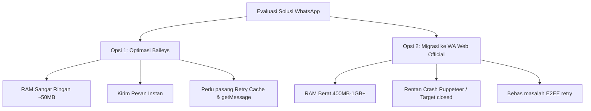

# Analisis & Solusi Integrasi WhatsApp: Baileys vs WA Web Official

Dokumen ini menjelaskan secara komprehensif mengenai arsitektur sesi WhatsApp pada aplikasi **CJ Helper**, analisis bentrok sesi (*session collision*) dengan browser Chrome/Firefox, penyebab pesan tertahan (**"Menunggu pesan ini..."**), serta panduan perbaikan kode teknis.

---

## 1. Apakah Akan Nabrak dengan Chrome / Firefox?

> **Jawaban Singkat:** **TIDAK AKAN NABRAK (Tidak saling menendang / logout)**, asalkan kuota slot Multi-Device di nomor WhatsApp Anda belum melebihi batas (maksimal 4 perangkat tertaut).

### Cara Kerja WhatsApp Multi-Device
WhatsApp menggunakan arsitektur **Multi-Device**:
1. **1 Nomor Utama (Ponsel)** dapat menghubungkan hingga **4 Perangkat Tertaut (*Linked Devices*)** secara bersamaan.
2. Setiap perangkat tertaut memiliki identitas enkripsi (*Identity Key*) dan penyimpanan sesi tersendiri.

| Perangkat / Sesi | Status Sesi | Keterangan |
| :--- | :--- | :--- |
| **Google Chrome (PC)** | Slot 1 | Menggunakan Cookie & IndexedDB browser Chrome |
| **Mozilla Firefox (PC)** | Slot 2 | Menggunakan Cookie & IndexedDB browser Firefox |
| **CJ Helper (Baileys / Server Sidecar)** | Slot 3 | Menggunakan folder auth terisolasi (`wa_session`) |
| **Sisa Kuota** | 1 Slot Tersedia | Bisa untuk WhatsApp Desktop atau laptop lain |

### Kapan Peringatan *"Gunakan di Sini"* Muncul?
Peringatan *"WhatsApp sedang terbuka di jendela lain. Klik 'Gunakan di sini' untuk beralih"* **HANYA** terjadi jika:
* Anda membuka **2 tab atau 2 jendela WhatsApp Web di dalam browser dan profil yang SAMA**.
* Hal tersebut terjadi karena kedua tab membaca file *Cookies/LocalStorage* yang sama persis.

Karena bot CJ Helper menggunakan folder sesi sendiri (`wa_session` untuk Baileys, atau direktori *user-data* terpisah jika memakai browser automation), sesi di Chrome dan Firefox Anda **tetap berjalan normal tanpa terganggu**.

---

## 2. Analisis Masalah: "Menunggu pesan ini..." (*Waiting for this message*)

> Notifikasi *"Menunggu pesan ini. Ini mungkin memerlukan waktu beberapa saat"* bukan karena server WhatsApp down, melainkan kegagalan pertukaran kunci enkripsi *End-to-End* (**Signal Protocol**).

### Mengapa Masalah Ini Muncul?
1. **Mekanisme Sender Key & Pre-Keys:**
   * Setiap pesan grup dienkripsi menggunakan *Sender Key*.
   * Sebelum anggota grup atau HP Anda bisa membaca pesan tersebut, mereka harus menerima kunci pembuka dari pengirim pesan (dalam hal ini, bot Baileys).
2. **Permintaan Pengiriman Ulang (*Retry Request*):**
   * Jika penerima atau HP Anda belum menerima kunci tersebut, perangkat mereka akan otomatis mengirim sinyal balik ke bot: *"Kunci enkripsi belum cocok, tolong kirim ulang (retry) kuncinya!"*
3. **Kelemahan Kode `server.js` Saat Ini:**
   * Di file `wa_server/server.js`, fungsi `makeWASocket()` belum dilengkapi dengan **`msgRetryCounterCache`** dan **`getMessage`**.
   * Ketika server WhatsApp mengirimkan permintaan *retry*, Baileys mengabaikannya karena tidak tahu pesan mana yang harus dikirim ulang kuncinya.
   * Akibatnya: **Pesan tersebut macet selamanya di status "Menunggu pesan ini..."**.

---

## 3. Temuan Audit Kode `wa_server/server.js`

Berikut adalah 3 poin krusial yang ditemukan pada kode berjalan saat ini:

### Temuan 1: Hilangnya Handler Retry Pesan
Di baris 66–74 `wa_server/server.js`:
```javascript
sock = makeWASocket({
  version,
  logger,
  printQRInTerminal: false,
  auth: authState,
  browser: ["CJHelper", "Chrome", "1.0.0"],
  syncFullHistory: false,
  generateHighQualityLinkPreview: false,
});
```
* **Dampak:** Tidak ada media penyimpanan sementara untuk merespons permintaan pertukaran kunci (*handshake retry*).

### Temuan 2: Nilai `browser` Menggunakan String Custom
* Nilai `["CJHelper", "Chrome", "1.0.0"]` membuat server WhatsApp mendeteksi klien sebagai *unrecognized browser*. Hal ini kerap memicu penundaan (*throttling*) pada pengiriman bundle *pre-key*.
* **Standar Baileys:** Menggunakan helper bawaan resmi, yaitu `Browsers.windows("Desktop")` atau `Browsers.ubuntu("Chrome")`.

### Temuan 3: Sinkronisasi Awal Belum Matang (*Initial Key Exchange*)
* Pengaturan `syncFullHistory: false` memang bagus untuk menghemat RAM dan CPU.
* Namun, jika pengguna langsung melakukan broadcast beberapa detik setelah scan QR, HP dan Baileys belum selesai menyinkronkan daftar identitas kunci grup.

---

## 4. Perbandingan Solusi



### Riwayat Log Sebelumnya (Pelajaran Berharga)
Pada riwayat file `wa_server/server.log` lama, proyek ini pernah mencoba menggunakan `whatsapp-web.js` (Puppeteer), namun mengalami crash berulang:
```text
TargetCloseError: Protocol error (Runtime.evaluate): Target closed
    at Client.inject (.../node_modules/whatsapp-web.js/src/Client.js:106:38)
```
> **Rekomendasi Terbaik:** **Tetap gunakan Baileys**, tetapi perbaiki konfigurasi `msgRetryCounterCache`, `getMessage`, dan `Browsers`. Cara ini jauh lebih hemat RAM, tidak membebani aplikasi Tauri, dan menyelesaikan masalah pesan tidak terbaca.

---

## 5. Panduan Langkah Perbaikan (Implementasi)

### Langkah 1: Instalasi Package Cache
Jalankan perintah berikut di direktori `wa_server`:
```bash
npm install node-cache
```

### Langkah 2: Perbaikan Kode `server.js`

Edit bagian inisialisasi Baileys di `wa_server/server.js` menjadi seperti berikut:

```javascript
const {
  default: makeWASocket,
  useMultiFileAuthState,
  DisconnectReason,
  fetchLatestBaileysVersion,
  Browsers, // 1. Tambahkan import Browsers resmi
} = require("@whiskeysockets/baileys");
const NodeCache = require("node-cache"); // 2. Import NodeCache

// 3. Inisialisasi Cache & Message Store
const msgRetryCounterCache = new NodeCache();
const sentMessagesStore = new Map(); // Menyimpan riwayat pesan terkirim bot

async function initWA() {
  // ...
  const { state: authState, saveCreds } = await useMultiFileAuthState(SESSION_DIR);
  const { version } = await fetchLatestBaileysVersion().catch(() => ({ version: [2, 3000, 1017531287] }));

  sock = makeWASocket({
    version,
    logger,
    printQRInTerminal: false,
    auth: authState,
    browser: Browsers.windows("Desktop"), // 4. Gunakan browser resmi Windows Desktop
    syncFullHistory: false,
    generateHighQualityLinkPreview: false,
    msgRetryCounterCache, // 5. Pasang cache retry untuk mengatasi desync kunci
    getMessage: async (key) => {
      // 6. WhatsApp meminta kirim ulang pesan jika belum terbaca
      if (sentMessagesStore.has(key.id)) {
        return sentMessagesStore.get(key.id);
      }
      return undefined;
    },
  });

  sock.ev.on("creds.update", saveCreds);
  // ...
}
```

### Langkah 3: Simpan Pesan Terkirim ke `sentMessagesStore`
Pada saat mengirim pesan (di endpoint `/send` dan `/broadcast`):

```javascript
// Kirim pesan
const sent = await sock.sendMessage(jid, { text: t.message });

// Simpan ke sentMessagesStore agar bisa di-retry jika WhatsApp memintanya
if (sent && sent.key && sent.key.id) {
  sentMessagesStore.set(sent.key.id, sent.message);
  
  // Batasi cache maksimal 500 pesan agar memori tetap hemat
  if (sentMessagesStore.size > 500) {
    const oldestKey = sentMessagesStore.keys().next().value;
    sentMessagesStore.delete(oldestKey);
  }
}
```

### Langkah 4: Reset Sesi Lama Sekali Saja
Setelah kode diperbaiki:
1. Tekan tombol **Reset / Logout Sesi** di CJ Helper atau hapus folder `wa_server/wa_session`.
2. Scan QR code baru melalui WhatsApp di HP Anda.
3. **Biarkan HP tetap terhubung ke internet selama 2-3 menit** setelah scan agar pertukaran kunci awal (*key handshake*) selesai sempurna sebelum mulai broadcast.
